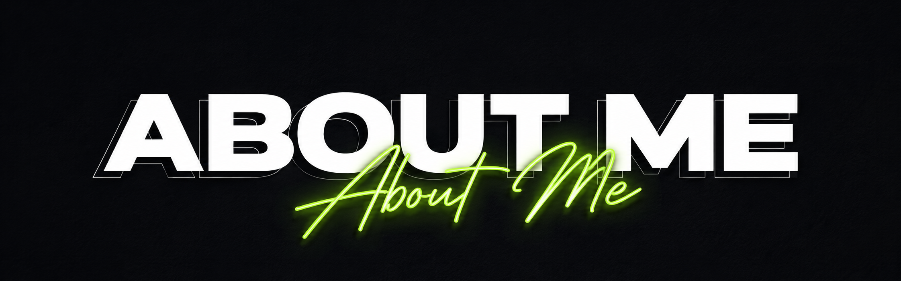

  

<h1 align="center">Hi 👋, I'm Bhavish V</h1>

---

## 👨‍💻 About Me

Dedicated Computer Science Engineering student with a strong foundation in programming and software development. Passionate about building real-world applications while continuously learning and exploring emerging technologies.

---

## 🎓 Education

**Bachelor of Engineering (B.E.) in Computer Science Engineering**

- 📍 Currently in Final Year

---

## 💻 Languages

  

---

## ⚙️ Frameworks & Libraries

  

---

## 🛠️ Tools

  

---

## 🎯 Areas of Interest

- 🔐 Cybersecurity
- 🚀 Emerging AI Technologies
- 🤖 Artificial Intelligence
- 🧠 AI Agents
- ☸️ Kubernetes

---

## 🌐 Connect With Me

  

  

